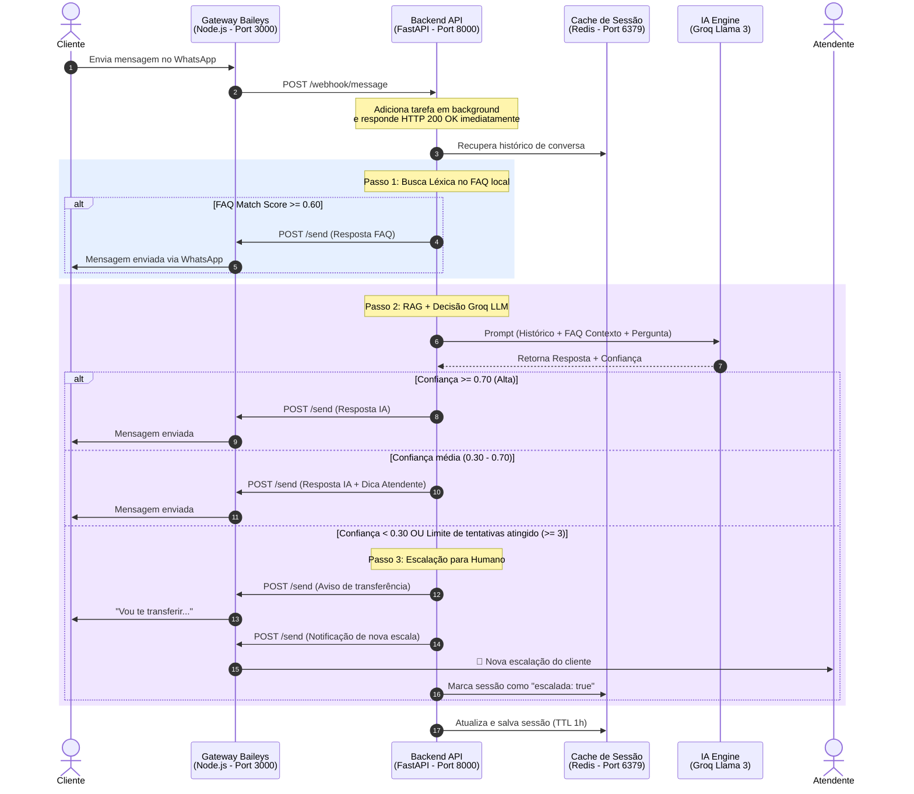

 # 🤖 WhatsApp AI Agent - Arquitetura do Sistema

Este repositório contém um **Agente de Atendimento Inteligente e Híbrido** para WhatsApp. Ele combina busca léxica rápida em base local de FAQ, geração aumentada por recuperação (RAG) usando modelos de linguagem avançados (via Groq/Llama 3) e uma camada resiliente de controle de sessão com transição automática para atendimento humano.

---

## 📌 Visão Geral do Sistema

O sistema é construído sobre uma **arquitetura de microsserviços de duas vias**:
1. **Frontend/Gateway (Node.js + Baileys)**: Gerencia a conexão física com a API do WhatsApp Web, capturando mensagens recebidas e enviando respostas.
2. **Backend/Inteligência (FastAPI + Python)**: Processa as regras de negócios, gerencia o histórico de conversa em cache rápida, consulta a base de conhecimento de FAQ e toma decisões de orquestração com a IA.



---

## 📂 Componentes e Estrutura de Arquivos

O projeto está estruturado da seguinte forma:

```bash
├── app/
│   ├── api/
│   │   └── webhook.py      # Rotas de Webhook e processamento assíncrono
│   ├── core/
│   │   ├── config.py       # Configurações e variáveis de ambiente (Pydantic)
│   │   └── database.py     # Inicialização e motor do SQLAlchemy
│   ├── models/
│   │   └── __init__.py     # Definição futura de tabelas estruturadas
│   ├── services/
│   │   ├── ai_service.py   # Integração com a API Groq e análise de confiança
│   │   ├── faq_service.py  # Mecanismo de busca léxica na base FAQ
│   │   ├── session.py      # Gerenciamento de estado de sessões no Redis
│   │   └── whatsapp.py     # Disparos de envio e escalação de mensagens
│   └── utils/
│       └── logger.py       # Logger customizado da aplicação
├── baileys/
│   ├── index.js            # Gateway Node.js com a biblioteca Baileys
│   └── package.json
├── docs/
│   └── faq.json            # Base local de perguntas frequentes
├── main.py                 # Ponto de entrada FastAPI e ciclo de vida
├── requirements.txt        # Dependências Python
└── .env.example            # Modelo de configurações de ambiente
```

---

## 🛠️ Detalhamento dos Módulos Técnicos

### 1. Gateway de Conexão WhatsApp ([index.js](file:///c:/GitHub/whatsapp-ai-agent/baileys/index.js))
* **Função**: Conecta-se ao WhatsApp via `@whiskeysockets/baileys` e gera o QR Code no terminal.
* **Escuta**: Intercepta mensagens recebidas que não sejam do próprio robô (`msg.key.fromMe`) e faz um `POST` no webhook do FastAPI (`/webhook/message`).
* **Disparo**: Expõe uma rota `/send` que permite ao backend Python enviar mensagens externas de volta aos usuários utilizando a conexão ativa.

### 2. Core API e Ciclo de Vida ([main.py](file:///c:/GitHub/whatsapp-ai-agent/main.py))
* **Função**: Inicializa o servidor FastAPI e define a política de `lifespan` assíncrona, garantindo que o banco de dados SQL e as estruturas necessárias estejam prontos ao subir o serviço.

### 3. Roteamento e Hub de Decisão ([webhook.py](file:///c:/GitHub/whatsapp-ai-agent/app/api/webhook.py))
* **Função**: Recebe as mensagens do gateway. Para garantir máxima rapidez de resposta à API externa do Baileys e evitar timeouts, joga o processamento lógico pesado para tarefas de segundo plano (`BackgroundTasks`) do FastAPI e responde `HTTP 200 OK` imediatamente.
* **Orquestração**: Executa o algoritmo de decisão lógica (FAQ -> RAG/IA -> Escalação).

### 4. Busca Léxica de FAQ ([faq_service.py](file:///c:/GitHub/whatsapp-ai-agent/app/services/faq_service.py))
* **Função**: Consome a base estática [faq.json](file:///c:/GitHub/whatsapp-ai-agent/docs/faq.json).
* **Mecanismo**: Realiza comparação de palavras-chave extraídas da mensagem com as palavras-chave mapeadas de cada resposta cadastrada. Se o score de similaridade for alto o suficiente (`>= 0.6`), retorna uma resposta imediata sem onerar a API do Groq.
* **RAG**: Caso a resposta não atinja o threshold direto, este serviço fornece os **top 3 FAQ mais próximos** como dados de contexto enriquecidos para o prompt da IA.

### 5. Camada Groq Llama 3 ([ai_service.py](file:///c:/GitHub/whatsapp-ai-agent/app/services/ai_service.py))
* **Função**: Conversa com o Groq usando o modelo especificado (`settings.GROQ_MODEL`).
* **Prompt de Sistema**: Configura o comportamento geral do assistente em português e força o retorno da linha `CONFIANÇA: [0 a 100]` no final de cada resposta.
* **Confiança**: Faz o parse dessa nota retornada e valida se ela atende ao limiar configurado (`AI_CONFIDENCE_THRESHOLD`).

### 6. Gerenciamento de Estado no Redis ([session.py](file:///c:/GitHub/whatsapp-ai-agent/app/services/session.py))
* **Função**: Utiliza Redis (`aioredis`) para manter o estado persistente do usuário.
* **Histórico**: Armazena as últimas 20 mensagens enviadas/recebidas para prover contexto de conversação contínuo ao Groq.
* **Parâmetros Mantidos**:
  * `history`: Histórico de conversação formatado.
  * `ai_attempts`: Contador de tentativas que a IA respondeu sem total confiança.
  * `escalated`: Flag booleana que indica se o usuário já foi transferido para um humano (se `true`, novas mensagens são sumariamente ignoradas pelo robô).

### 7. Envio e Escalação ([whatsapp.py](file:///c:/GitHub/whatsapp-ai-agent/app/services/whatsapp.py))
* **Função**: Centraliza as chamadas de API externa de saída enviadas ao gateway Baileys.
* **Notificação**: Ao escalar a conversa para um atendente, dispara um alerta diretamente para o número configurado em `settings.HUMAN_PHONE` com a mensagem do cliente.

### 8. Painel Administrativo e CRM CRM
* **Gestão de Equipe**: CRUD completo de administradores e usuários do painel (Adicionar, Editar e Remover).
* **Sincronização de Perfil (WhatsApp)**: O gateway intercepta ativamente as mensagens para capturar e baixar as **fotos reais do perfil do WhatsApp** dos pacientes em tempo real, enriquecendo a experiência visual da clínica no banco de dados.

---

## 🚦 Algoritmo de Resposta e Fluxo de Decisões

1. **Mensagem Recebida**: Carrega os dados da sessão do Redis. Se `escalated` for `True`, encerra imediatamente.
2. **Avaliação FAQ**: Busca correspondência no FAQ.
   * *Match >= 0.60*: Envia resposta direto do FAQ. Zera tentativas. Atualiza histórico.
   * *Sem Match*: Continua para o fluxo da IA.
3. **Execução IA (RAG)**: Envia o histórico + Top 3 FAQs mais próximos + Pergunta do cliente.
4. **Análise da Confiança da IA**:
   * **Confiança >= Threshold (Ex: 70%)**: Envia resposta da IA limpa.
   * **Confiança Média (Ex: entre 30% e 70%)**: Envia a resposta da IA acompanhada de um aviso informando que ele pode solicitar um atendente humano a qualquer momento.
   * **Confiança Baixa (< 30%) OU Limite de Tentativas Estourado (Ex: >= 3)**: Dispara fluxo de escalação. Envia aviso ao cliente, notifica o número do atendente humano via WhatsApp, e seta a flag `escalated: true` no Redis.

---

## 🚀 Como Executar o Sistema

### Pré-requisitos
* **Node.js** v18+ instalado.
* **Python** v3.10+ instalado.
* **Redis Server** rodando localmente na porta 6379 (ou acessível via URI).

### 1. Configurando o Ambiente
Crie um arquivo `.env` na raiz do projeto baseado no `.env.example`:
# 📦 Configuração e Execução

## 1️⃣ Configurando o Ambiente

```bash
# Copie o arquivo de exemplo de variáveis de ambiente
cp .env.example .env

# Edite o .env e preencha as variáveis:
#   - GROQ_API_KEY: sua chave da API Groq
#   - HUMAN_PHONE: número do atendente (ex.: 5511999999999)
```

## 2️⃣ Criando usuário administrador (seed)

```bash
# Cria um admin de teste (email: admin@exemplo.com, senha: senha123)
python scratch/seed_admin.py
```

## 3️⃣ Inicializando o Backend (FastAPI)

```bash
# Crie e ative o ambiente virtual
python -m venv venv
venv\\Scripts\\activate  # Windows
# ou source venv/bin/activate  # Linux/macOS

# Instale as dependências Python (arquivo backend/requirements.txt)
pip install -r backend/requirements.txt

# Rode o servidor FastAPI
uvicorn backend.main:app --host 127.0.0.1 --port 8000
```

## 4️⃣ Inicializando o Frontend (Gateway Baileys)

```bash
cd baileys
npm install
node index.js
```

> Escaneie o QR Code que aparecerá no terminal para conectar ao WhatsApp.

## 5️⃣ Acessando o Painel

Abra o navegador em `http://127.0.0.1:8000/`. Use as credenciais do admin criado acima (email **admin@exemplo.com**, senha **senha123**) para acessar a interface.
Preencha a variável `GROQ_API_KEY` com sua credencial Groq e `HUMAN_PHONE` com o número de WhatsApp do atendente que receberá as escalações (com DDI + DDD, ex: `5511999999999`).

### 2. Inicializando o Gateway (Baileys)
Entre na pasta `baileys`, instale as dependências e rode o serviço:
```bash
cd baileys
npm install
node index.js
```
*Escaneie o QR Code que aparecerá no terminal com o celular conectado ao WhatsApp.*

### 3. Inicializando o Backend (FastAPI)
Em outro terminal (na raiz do projeto), instale os pacotes Python e inicie o servidor:
```bash
python -m venv venv
# No Windows:
venv\Scripts\activate
# No Linux/Mac:
source venv/bin/activate

pip install -r requirements.txt
uvicorn main:app --reload --port 8000
```

O sistema estará operacional e pronto para responder mensagens recebidas de forma 100% autônoma e segura!
